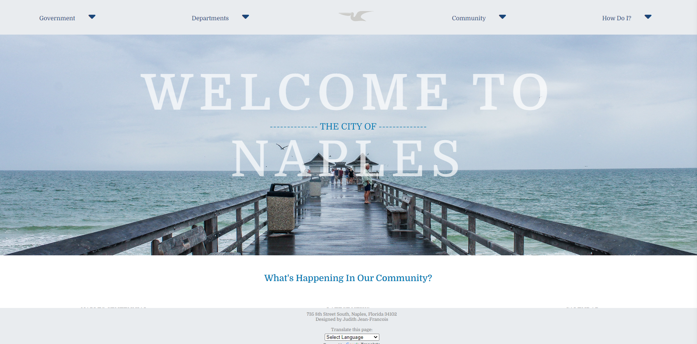

# Hometown-Homepage-Final

## Table of contents

- [Overview](#overview)
  - [The challenge](#the-challenge)
  - [Screenshot](#screenshot)
  - [Links](#links)
- [My process](#my-process)
  - [Built with](#built-with)
  - [What I learned](#what-i-learned)
  - [Continued development](#continued-development)
  - [Useful resources](#useful-resources)

## Overview
Created a homepage/landing page for my hometown- Naples Florida.

### The challenge

Users should be able to:
-	Navigate through the website in both mobile and desktop view
-   Use the dropdown nav to find more relevant links for their search
-	Click on links that will open pages from the current Naples webpage
-	Hover over the menu images to read more about some of the features/events relevant to Naples
-	Click on social media icons to follow Naples on other platforms 
-	Translate the page to other languages using a Google Translate feature available in the footer
-	Tab through sections (for screen readers/keyboard users)

### Screenshot

### Links

- Solution URL: https://github.com/Jud1th1/Hometown-Homepage-Final
- Live Site URL: https://naples-homepage.netlify.app/

## My process
-	My process
-	To create this homepage, I began by conducting research on other city homepages and reviewed the current Naples homepage to determine which elements to retain and improve upon.
-	Next, I carefully selected a color scheme and curated coastal-inspired imagery to complement the city's unique aesthetic.
-	The HTML layout was largely influenced by the current Naples homepage, while the majority of my creative decisions were made in the CSS stylesheet. I aimed to streamline the navigation and give it a cleaner appearance, with a focus on the main navigation links and the addition of a pelican logo to reflect the area's amazing birdlife.
-	In mobile view, I utilized flex display to stack navigation links vertically, rather than opting for a toggle menu, to provide a faster and more intuitive experience for users who want to get straight to the point.
-	I added a striking hero image of the Naples pier, a key attraction of the city, which effectively captures its natural beauty.
-	For the navigation section, I strategically titled it "What's Happening in Our Community" to draw users' attention and provide a clear understanding of the section's contents. I summarized some of the features from the current website onto my webpage, which users could hover over to preview content before clicking.
-	I applied a transparent black color overlay to the image that would appear when the user hovers over it. Additionally, I included text animation to have the text slide up from the bottom of the container.
-	I then added social media icons using flexbox and extra padding.
-	I added a translation feature to the footer of the website, which was a crucial aspect for me as Naples is a culturally diverse city and there may be users, including my parents, who primarily speak a language other than English. I researched and found a code on W3Schools to implement this feature and ensure accessibility and inclusivity for all users.

Accessibility updates
-	I prioritized accessibility by running my code through accessibility tools like accessibe.com to ensure compliance with ADA and WCAG standards. I believe that designing with accessibility in mind is critical to creating inclusive technology for all
-	Additionally, I created a Figma file to track areas where I could improve accessibility, and used it to develop a prototype that helped me make improvements to my code. 
-	I'm still working on certain accessibility issues, such as orientation and keyboard focus, but I am committed to making continuous improvements as my skills evolve.

### Built with

- HTML
- Flexbox
- CSS
- Javascript (Import Google Translate)

### What I learned

-	How to create a dropdown navigation
-	How to create a color overlay on images
-	How to translate my page

### Continued development

- I plan on correcting the issues with my webpage orientation so that screen readers/keyboard users can properly navigate with the tab key.

### Useful resources
    // Current Naples website 
-   https://www.naplesgov.com/     

    //My Figma files: 
-    https://www.figma.com/file/x5ht5VS7FsNOLjmfo9r64r/Hometown-Homepage?type=design&node-id=1%3A2&t=PSIjLcBNWhfJCKod-1

    //How I check for accessibility
-   https://accessibe.com/    
-   https://www.a11yproject.com/checklist/

    //Helpful tutorials
-   https://www.w3schools.com/howto/howto_css_dropdown_navbar.asp    //for dropdown navigation
-   https://www.w3schools.com/howto/howto_google_translate.asp      //for Google translation feature